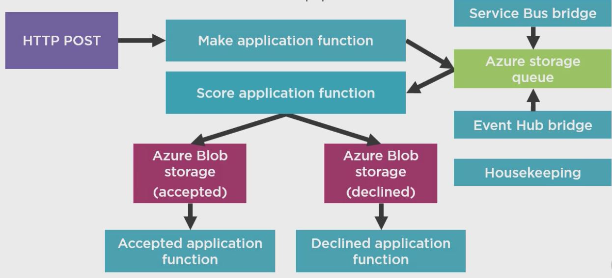

# PreCompiled "C#" FunctionApps

PreCompiled is using C# not csx

1. Usefull for VS Develop, Debug and intellicense 

2. Can simulate local Storage for BLOB-Storage 

3. Writing Unit Tests 


## local.settings.json (using remote storage account)

```
{
    "IsEncrypted": false,
  "Values": {
    "AzureWebJobsStorage": "DefaultEndpointsProtocol=https;AccountName=ae76a2db28ee54684b66f483;AccountKey=Q+Co9pijZo93iTe4wtw3suVb1/bdkplBvU40RXkGMOPLHCK9OWBo4yppP6gp9VVCZWDO89o2KpAMXrXU3Ber9w==;EndpointSuffix=core.windows.net",
    "AzureWebJobsDashboard": ""
  }
}

```


## local.settings.json (using local Storage emulator)

```
{
    "IsEncrypted": false,
  "Values": {
    "AzureWebJobsStorage": "UseDevelopmentStorage=true",
    "AzureWebJobsDashboard": ""
  }
}

```


## local.settings.json (AzureWebJobs)

```
{
    "IsEncrypted": false,
  "Values": {
    "AzureWebJobsStorage": "UseDevelopmentStorage=true",
    "AzureWebJobsDashboard": "",
    "AzureWebJobsServiceBus":"Endpoint=sb://loanapplicationX.servicebus.net/;SAS",
    "AzureWebjobsLoanApplicationsEventHub":"Endpoint=sb://loanapplicationY.servicebus.net/;SAS"
  }
}

```


## Test

```
 http post  http://localhost:7071/api/MakeApplication name='Jalal' age='40'

```


## Flow 

